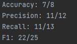

# ballet-injury-prediction

"Ballet injury prediction" is a project developed in the Clojure programming language that enables precise prediction of injury risk in ballet dancers. This powerful tool provides support to ballet trainers in organizing and planning ballet studio activities. Trainers will be able to make decisions about which dancers can perform during the current week and which ones should exercise caution due to an increased risk of injury.

The data used for this project is authentic and obtained from a ballet studio where I trained in ballet for over 10 years. The data is located in a CSV file: ballet-dancers.csv. The predictors are the following columns:

- Height: The height of the ballet dancer.
- Weight: The weight of the ballet dancer.
- Age: The age of the ballet dancer.
- Experience: The number of years the dancer has been a member of the ballet studio.
- Performances per week: The number of performances the dancer had in that particular week.
- Footwear type: Pointe ballet shoes" (1) or regular ballet shoes (0).
- Previous injuries: The number of serious injuries the dancer has had in their life, both related to ballet and outside of it.

The application enables efficient loading of data from a CSV file and performs data preprocessing steps. Data preprocessing is crucial for the KNN algorithm to provide accurate and reliable predictions. After calculating the number of outliers, data standardization is applied. This functionality ensures that values are within a similar range to achieve consistency and eliminate the possibility of excessive influence from individual predictors on classification. This improves the quality of analysis and allows for a more accurate determination of neighbors.

For the classification of ballet dancers in terms of injury risk, the K-nearest neighbors (KNN) algorithm is implemented. Various evaluation metrics are also implemented to provide a detailed analysis of the performance of the KNN model. The results that I obtained are shown in the image below.

The KNN model has a really good results for this problem. The results of the model could vary highly depending on the shuffling of the dataset.

The challenges I encountered during the development of the application involved integrating the Clojure programming language with machine learning concepts. Since I hadn't previously had the opportunity to work with machine learning within the Clojure programming language, it was necessary for me to explore and master new approaches specific to that combination. Successfully overcoming this challenge required a deep understanding of the fundamentals of machine learning algorithms, as well as finding the right resources supported in the Clojure programming language.

Throughout the development process of this application, I conducted research on various approaches people have attempted to implement the K-nearest neighbors (KNN) algorithm in the Clojure programming language. Although I came across different resources and implementation examples, I noticed that none of them provided a complete solution. This inspired me to explore and experiment in order to find the most efficient and practical way that would be comprehensive and include all the necessary components for the KNN algorithm.

While my project focused on predicting injury risk in ballet dancers, this project can be useful to anyone who wants to apply the KNN algorithm to solve their problem. All that is needed is a CSV file with numerical data, and the application offers the following features:

- Calculation of the number of outliers among the data
- Data standardization
- Prediction based on KNN algorithms
- Computation of evaluation metrics
## License

Copyright © 2023 FIXME

This program and the accompanying materials are made available under the
terms of the Eclipse Public License 2.0 which is available at
http://www.eclipse.org/legal/epl-2.0.

This Source Code may also be made available under the following Secondary
Licenses when the conditions for such availability set forth in the Eclipse
Public License, v. 2.0 are satisfied: GNU General Public License as published by
the Free Software Foundation, either version 2 of the License, or (at your
option) any later version, with the GNU Classpath Exception which is available
at https://www.gnu.org/software/classpath/license.html.
